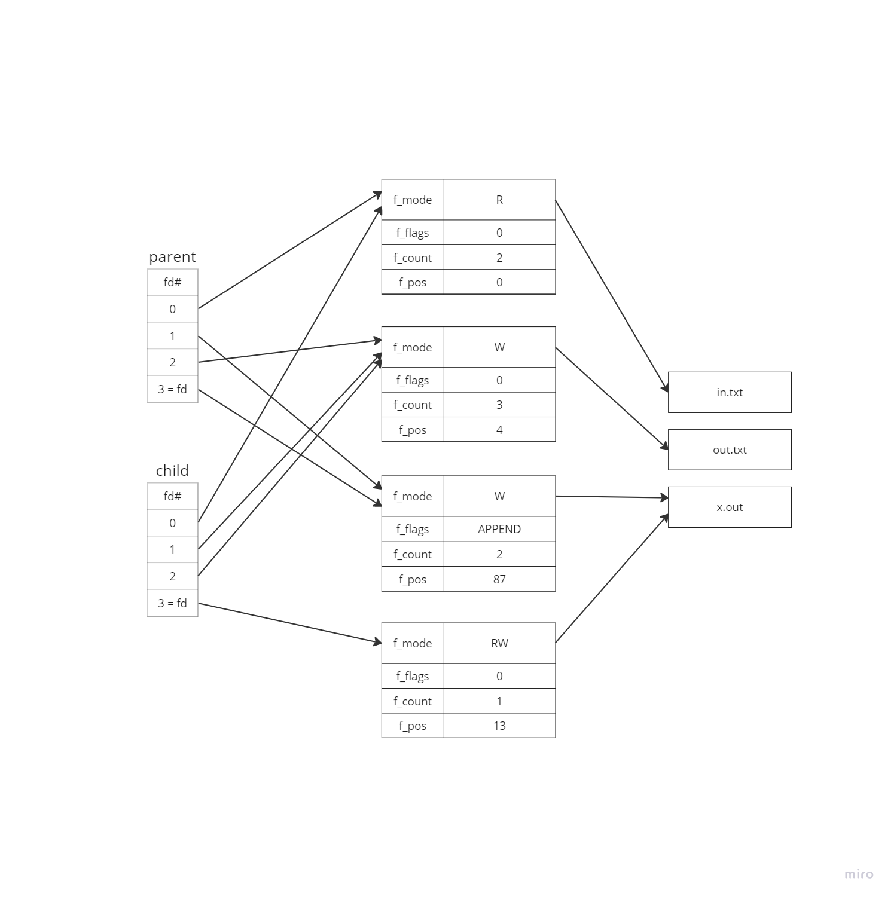

# Problem 2 -- File Descriptor Tables
```c
/*  Assume the program below was invoked with the following command line:
    ./program <in.txt >out.txt 2>&1
Further, assume that all systems calls in the code below succeed
Assume that prior to execution, files in.txt and out.txt exist, and the file x.out consists of 79 ’K’ characters followed by ’\n’ (therefore it is 80 bytes long)  */
main()
{
    int pid,fd;char buf[4096];
    switch(pid=fork())
    {
        case -1:perror("fork");return -1;
        case 0: fd=open("x.out",O_RDWR);read(fd,buf,10);break;
        default: fd=open("x.out",O_WRONLY|O_APPEND);dup2(fd,1);break;
    }
    write(fd,"ABC",3);
    write(1,"WXYZ",4);
    /*  Sketch the file descriptor tables of both parent and child processes when they have both reached this point. Also sketch the open files "table" (struct file entries) showing the connections between them and then per-process fd tables as well as to the in-core inodes. Show the values of the f_mode, f_flags, f_count and f_pos fields. It is sufficient to denote the inodes by the name of the file that they represent, similar to how these diagrams were presented in the lecture notes and in class. Also, describe the contents of x.out at this point.  */
    for(;;)
    /* endless loop */;
}
```

File Table Graph:  


Content of x.out:  
```
KKKKKKKKKKABCKKKKKKKKKKKKKKKKKKKKKKKKKKKKKKKKKKKKKKKKKKKKKKKKKKKKKKKKKKKKKKKKKK
ABCWXYZ
```