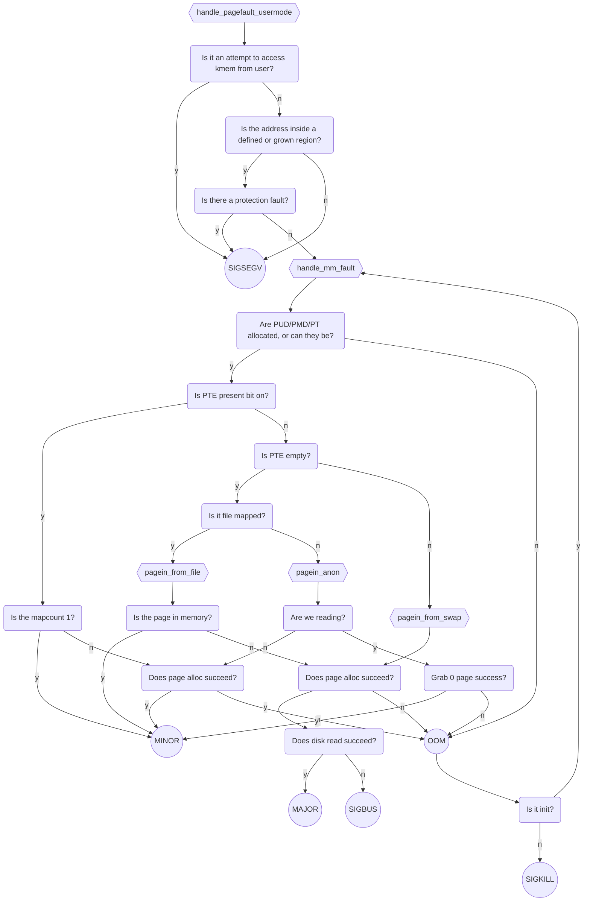
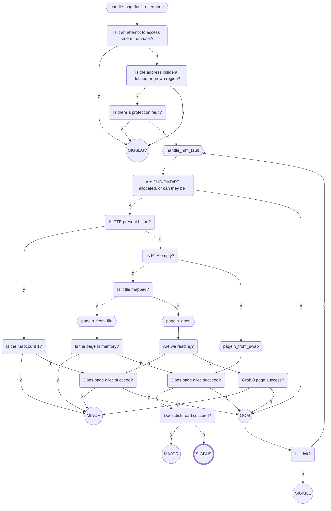
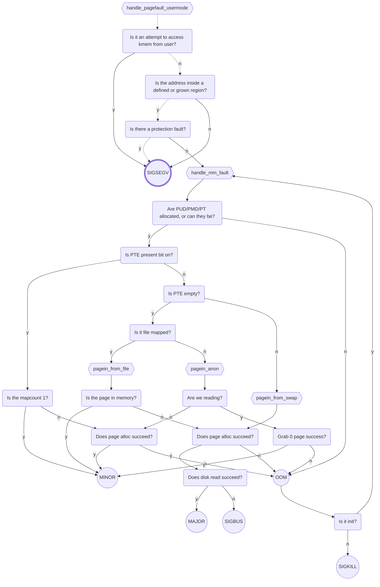
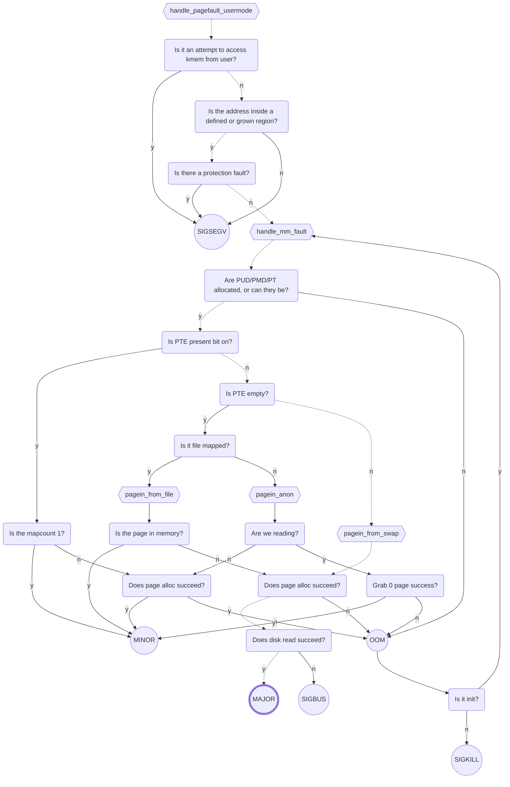

**Problem 2 -- Thoughts about Memory**

2A) One way to think about page frame reclamation / paging-out is that physical memory is a scarce, faster resource which caches virtual memory. As with any cache where cache capacity is scarce, we’d want the items that are in the cache to be the ones that are most likely to be used again soon. Conversely, we’d want to evict items from the cache based on a Least Recently Used (LRU) policy.

Question to ponder: Does the scheme described in the lecture notes, with the use of the hardware PTE "A" bits and the PFRA algorithm, achieve true LRU behavior? If not, does it come close and how?
<div style="color: green;">
The use of "A" bits does not achieve true LRU behavior, because all the pages that are accessed between last PFRA visit and now, will appear the same regardless of recency. But this does come close, because the fewer page frames we have available, the more often the PFRA will visit. And the shorter the interval between two PFRA visits, the more accurate the result will be. 
</div>
<br>

2B) In your own words, what does the radix-64 tree of the address_space data structure do? Under what circumstances is this data structure used during paging-in operations? Give an example of a situation where consultation of that data structure allows the kernel to resolve a page fault as a minor vs a major page fault.
<div style="color: green;">
The radix-64 tree is used to determine if the same thing that the faulting process is trying to access is already in memory. Suppose a process tries to access a text region in an a.out, and another instance is already running this a.out. The page fault can be resolved by pointing the PTE to the existing instance of it in memory, which will cause no disk access, so it'll be a minor page fault instead of a major. 
</div>
<br>

**IF THERE IS NO MERMAID VIEWER, SEE p2-manmade.md**

2C-H) Each of the following situations involves a page fault. Describe what happens in the kernel’s page fault handler. If the page fault results in a signal, state what that signal is. If the page fault is resolved and does not cause a signal, state whether the resolution is a MAJOR or MINOR page fault:


2C) A newly exec’d program begins execution and attempts to fetch the first opcode of the text region. The associated a.out file has not been accessed before by any other program.


Resolution: MAJOR Page Fault

<br>

2D) A page in the BSS region is written to. This is the first access (read or write) to that particular virtual page during the lifetime of this program.


Resolution: MINOR Page Fault

<br>

2E) Immediately after a fork() system call, the child process writes to a global variable which had been declared with an initializer. The variable had been read (but not written) prior to the fork, and the PFRA is not active so any previously faulted-in page frames are still resident.


Resolution: MINOR Page Fault

<br>

2F) A file is mapped using the mmap system call with the MAP_SHARED option. The length of the mapping is 16384 bytes and this is also the length of the file. After the mapping is established, the file is truncated to 0 bytes. Then the [4096] byte of the mapped region is accessed for reading.


"Resolution": Signal SIGBUS

<br>

2G) The current size of the stack region is 8192 bytes on an X86-32 system. It extends from BFFFE000 - BFFFFFFF. The stack pointer is right at the edge of this region, at BFFFE000. Now we call another function.


Resolution: MINOR Page Fault

<br>

2H) We run the following:
```c
main() {
  char* p;
  p = (char*) main;
  *p = 41;
}
```
**FIRST WE ACCESS FIRST OPCODE**


Resolution: MAJOR Page Fault

<br>

**THEN WE WRITE TO STACK FOR THE CALL OF MAIN**


Resolution: MINOR Page Fault

<br>

**THEN WE CHANGE TARGET OF P TO 41**


"Resolution": Signal SIGSEGV

<br>

2I) We have read and written to a particular page in BSS. The PFRA is active and stole the page because we hadn’t subsequently accessed it for quite some time. Now we attempt to read that page.


Resolution: MAJOR Page Fault

<br>
