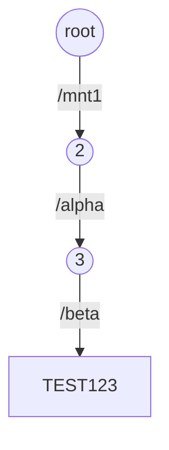
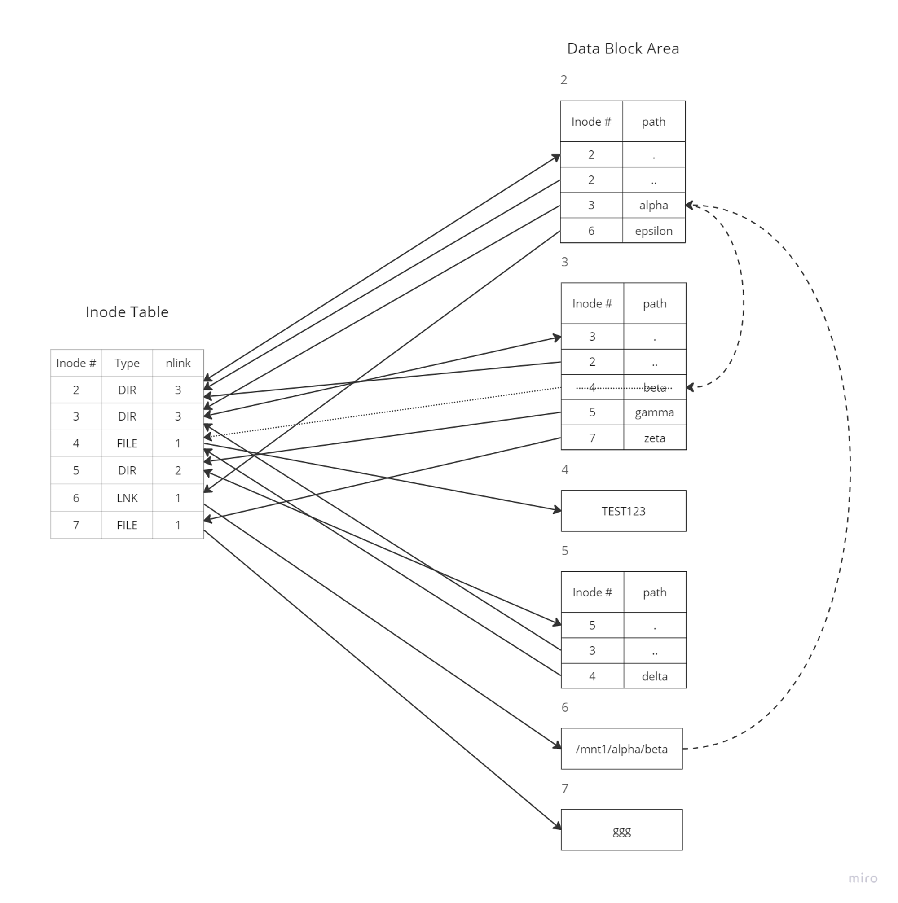
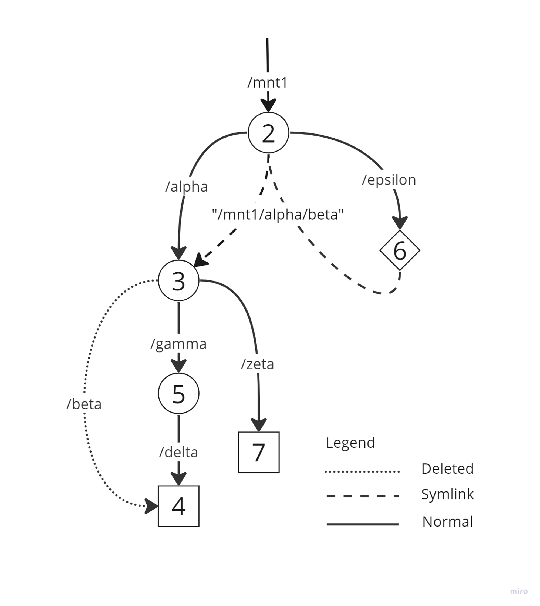

In this problem, you’ll trace out the operation of a simple, hypothetical filesystem which follows the principles laid out under "UNIX Filesystems" in the lecture notes. Specifically, we envision this filesystem as having a superblock, inode table, free map and data block areas. To simplify this problem, we can represent the inode "table" schematically, as in the lecture notes, as a table with rows representing inodes and columns the fields of the inode. I.e. we won’t concern ourselves with the actual on-disk layout of the inode. We’ll also ignore the superblock and the free map. We shall not worry about how the filesystem actually allocates data blocks. Directories will be represented as a table of name/inode# pairs. We won’t delve into how the directory is actually laid out, or how much disk space it takes. Here are a few more assumptions:

- The first inode is #2 (as is conventional)
- When allocating an inode, the lowest numbered free inode is used (Deleted inode numbers are placed back in the free pool to be re-used)
- Directories are in order of directory entry creation time (not sorted by name or inode #, etc.)

Now, let’s get started. I’ve initialized a volume and made the first file and the first subdirectory:

```bash
mkfs /dev/sda1 #Don’t try this at home, folks!
mount /dev/sda1 /mnt1
mkdir /mnt1/alpha
echo "TEST123" >/mnt1/alpha/beta
```

This is what the volume looks like at this point, so you have a clear idea of the representational format:



Now I perform the following operations:

```bash
mkdir /mnt1/alpha/gamma
ln /mnt1/alpha/beta /mnt1/alpha/gamma/delta
ln -s /mnt1/alpha/beta /mnt1/epsilon
rm /mnt1/alpha/beta
echo "ggg" >/mnt1/alpha/zeta
```

Sketch the inode table and directories at this point. Make sure your sketch is complete, clear, and legible. If you can’t neatly by hand, use a program to draw the diagram. We recognize the inode types DIR, FILE (REG), LNK.

<div style="display: flex;">
    
    
</div>