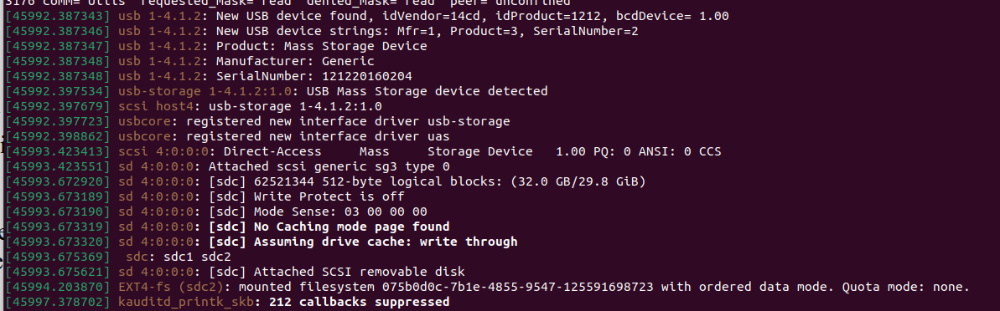
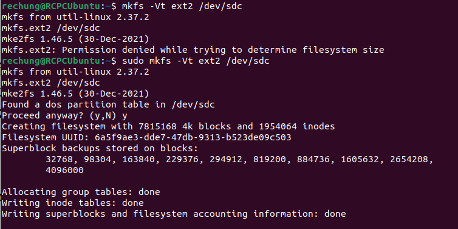
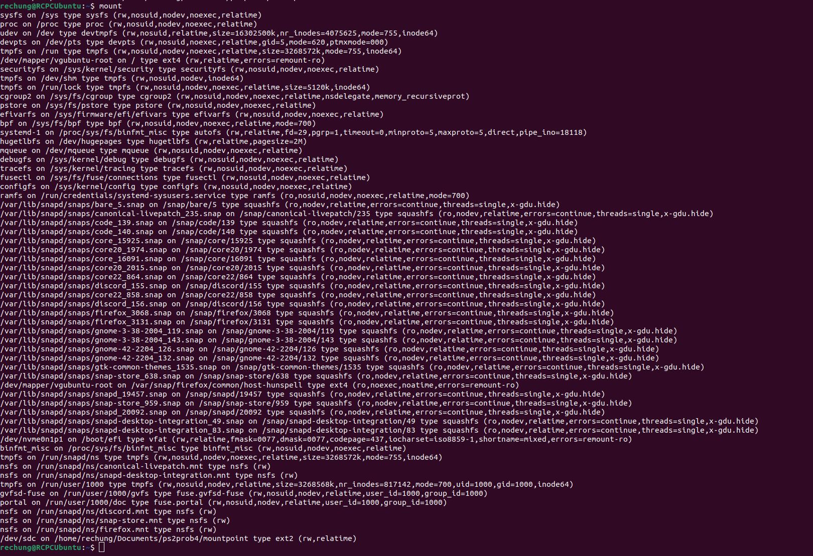
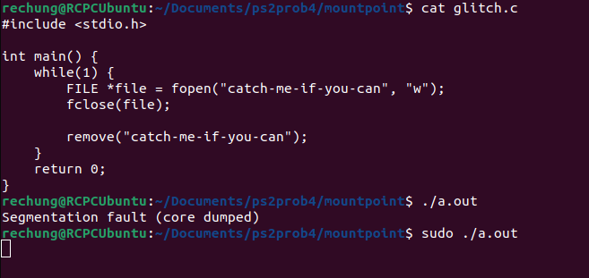
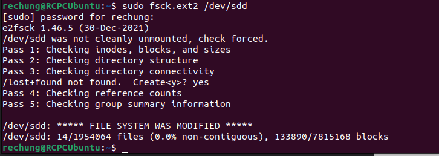
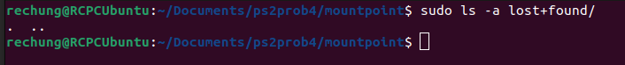
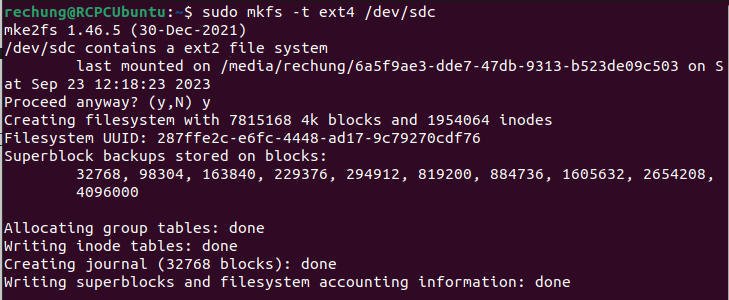
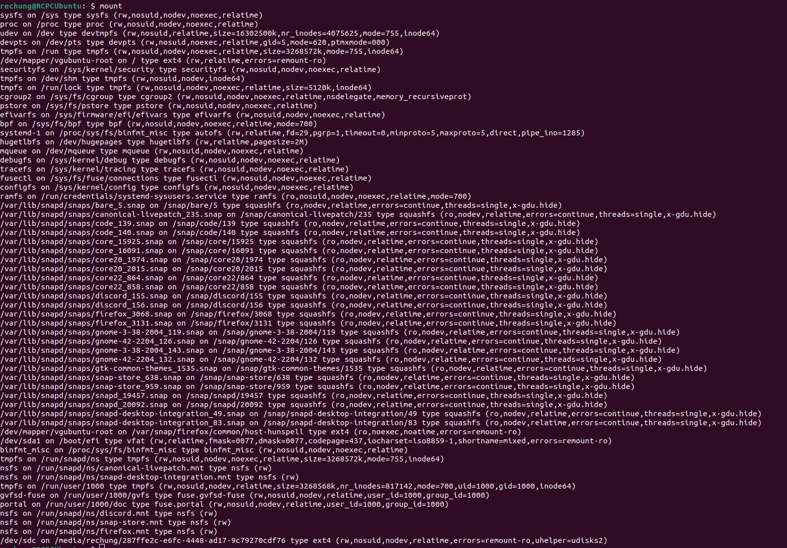
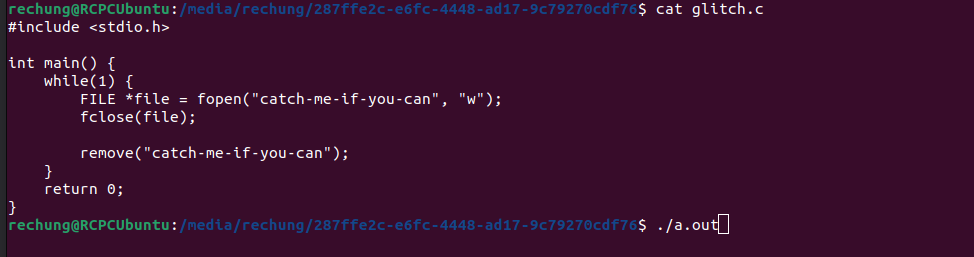

**Problem 4 -- Extra Credit Filesystem corruption and recovery**

1. Obtain a USB memory stick or USB external hard disk that you don’t care about. All data on this device will be
destroyed in this experiment.
2. Attach this device to your system. Using the dmesg command you should see some system log messages which
reveal which device node the kernel has assigned to the drive. 

3. Make a Linux EXT2 filesystem on the disk (OK to use either a partition or the entire disk). Make sure journalling
is NOT enabled in this case. Show the commands and responses.

Command: sudo mkfs -Vt ext2 /dev/sdc

4. Mount the disk. Show the output of the mount commands (without any arguments) which shows the mounted
volume. 

The bottom line is the relavant one (/dev/sdc)

5. Run a test program to generate endless disk metadata activity, e.g. repeatedly create, rename and delete files. 

6. Disconnect the disk while it is active. CAUTION: this may hang your system for a while, and may require a
reboot to recover.

7. Reconnect the disk. Run fsck to repair the filesystem

Now mount it and see if any files have appeared in lost+found.

8. Make a new Linux EXT3 or EXT4 filesystem on the disk (overwriting the previous filesystem). Make sure
journalling IS enabled this time.

Journaling seen by the "create journal" message

9. Mount the filesystem and perform your steps 4 - 6 again.

Once again, filesystem found in /dev/sdc

Program ran, and drive removed. 

Bottom 3 lines: 
    - 1 orphan inode deleted
    - recovery complete
    - mounted filesystem