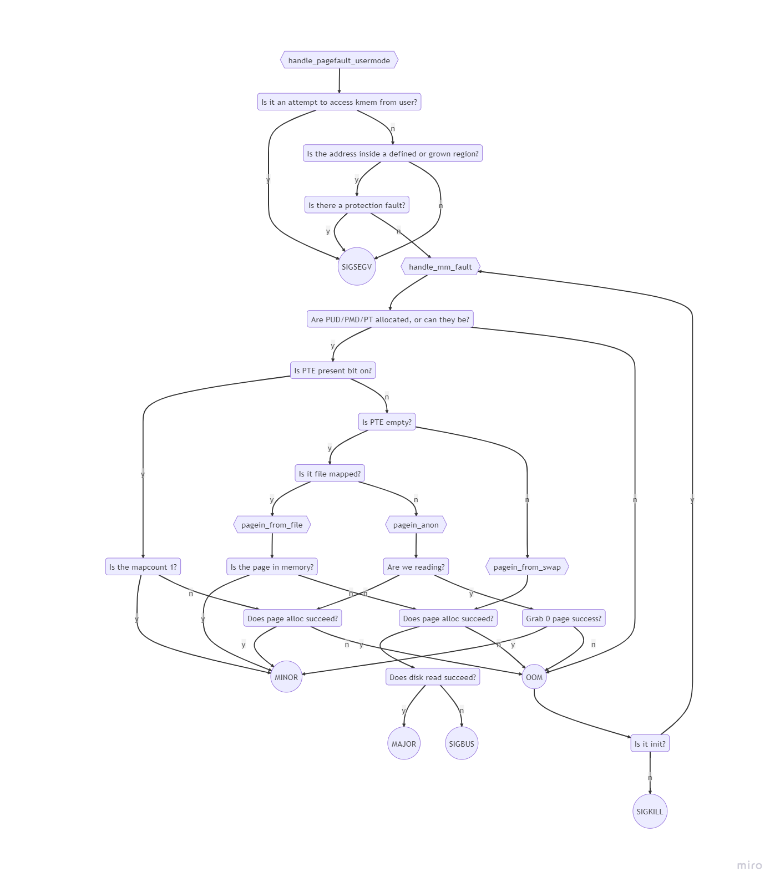
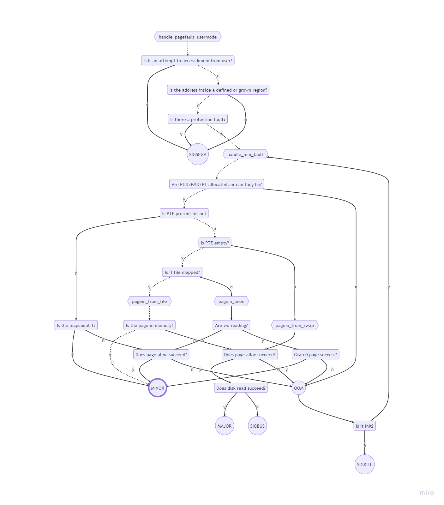

**FOR 2A AND 2B SEE p2-mermaid.md**

2C-H) Each of the following situations involves a page fault. Describe what happens in the kernel’s page fault handler. If the page fault results in a signal, state what that signal is. If the page fault is resolved and does not cause a signal, state whether the resolution is a MAJOR or MINOR page fault:


2C) A newly exec’d program begins execution and attempts to fetch the first opcode of the text region. The associated a.out file has not been accessed before by any other program.


2D) A page in the BSS region is written to. This is the first access (read or write) to that particular virtual page during the lifetime of this program.


2E) Immediately after a fork() system call, the child process writes to a global variable which had been declared with an initializer. The variable had been read (but not written) prior to the fork, and the PFRA is not active so any previously faulted-in page frames are still resident.


2F) A file is mapped using the mmap system call with the MAP_SHARED option. The length of the mapping is 16384 bytes and this is also the length of the file. After the mapping is established, the file is truncated to 0 bytes. Then the [4096] byte of the mapped region is accessed for reading.


2G) The current size of the stack region is 8192 bytes on an X86-32 system. It extends from BFFFE000 - BFFFFFFF. The stack pointer is right at the edge of this region, at BFFFE000. Now we call another function.


2H) We run the following:
```c
main() {
  char* p;
  p = (char*) main;
  *p = 41;
}
```
**FIRST WE ACCESS FIRST OPCODE**

**THEN WE WRITE TO STACK FOR THE CALL OF MAIN**

**THEN WE CHANGE TARGET OF P TO 41**


2I) We have read and written to a particular page in BSS. The PFRA is active and stole the page because we hadn’t subsequently accessed it for quite some time. Now we attempt to read that page.

